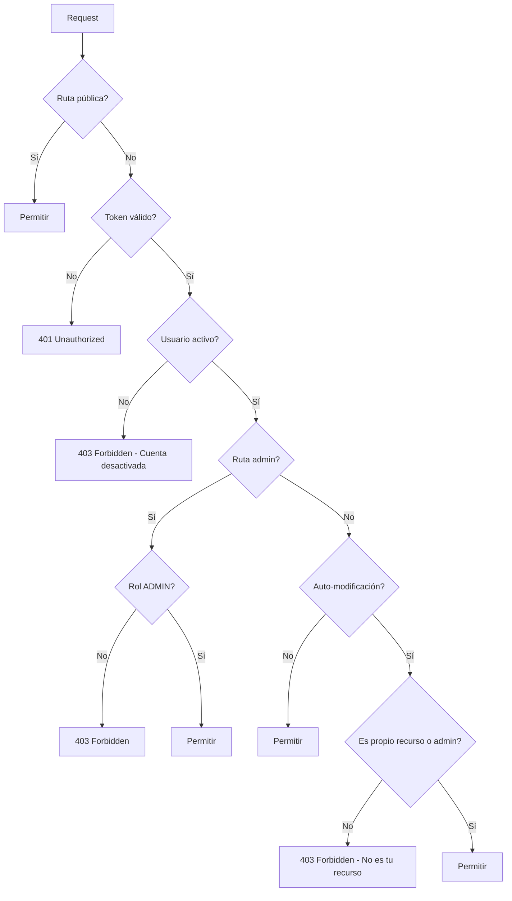

# 🔒 Configuración de Seguridad - Feeling Backend

## 📋 Resumen de la Configuración

La configuración de seguridad implementada proporciona un control granular de acceso con múltiples niveles de autorización:

### 🔓 **RUTAS PÚBLICAS** (No requieren autenticación)

#### Sistema y Documentación
- `/swagger-ui/**`, `/v3/api-docs/**` - Documentación API
- `/`, `/system`, `/health` - Endpoints de salud del sistema
- `/favicon.ico`, `/error` - Recursos estáticos

#### Autenticación y Registro
- `POST /auth/register` - Registro de nuevos usuarios
- `POST /auth/login` - Inicio de sesión
- `POST /auth/google/register` - Registro con Google OAuth
- `POST /auth/google/login` - Login con Google OAuth
- `POST /auth/verify-email` - Verificación de email
- `POST /auth/resend-verification` - Reenvío de código
- `POST /auth/forgot-password` - Recuperación de contraseña
- `POST /auth/reset-password` - Reseteo de contraseña
- `POST /auth/refresh-token` - Renovación de tokens
- `GET /auth/check-email/**` - Verificación de email disponible
- `GET /auth/check-method/**` - Verificación de método de login
- `GET /auth/status/**` - Estado de usuario

#### Datos de Configuración (públicos para registro)
- `/geographic/**` - Datos geográficos (países, ciudades)
- `/user-attributes/**` - Atributos de usuario
- `/category-interests/**` - Categorías de interés
- `GET /tags/popular` - Tags populares
- `GET /tags/search` - Búsqueda de tags
- `GET /tags/trending` - Tags en tendencia

#### Eventos (lectura pública)
- `GET /api/events/**` - Listado público de eventos

---

### 🔒 **RUTAS AUTENTICADAS** (Requieren token válido)

#### Sesión y Perfil
- `POST /auth/logout` - Cerrar sesión
- `GET /auth/session-info` - Información de sesión
- `GET /users/profile` - Ver perfil propio
- `PUT /users/profile` - Actualizar perfil propio
- `POST /users/complete-profile` - Completar perfil
- `PUT /users/deactivate-account` - Desactivar cuenta propia

#### Gestión de Usuarios (Auto-modificación controlada)
- `GET /users/**` - Ver perfiles de usuarios
- `PUT /users/**` - **Controlado por SelfModificationFilter**
- `PATCH /users/**` - **Controlado por SelfModificationFilter**

#### Matching y Búsquedas
- `/matches/**` - Sistema de matching
- `/users/search` - Búsqueda de usuarios
- `/users/suggestions` - Sugerencias de usuarios
- `/users/tags/**` - Gestión de tags de usuario

#### Eventos y Reservas
- `POST /api/events/**` - Crear eventos
- `PUT /api/events/**` - Modificar eventos propios
- `DELETE /api/events/**` - Eliminar eventos propios
- `/api/bookings/**` - Sistema de reservas

#### Soporte y Quejas
- `POST /api/support/complaints` - Crear queja/consulta
- `GET /api/support/my-complaints` - Ver mis quejas
- `GET /api/support/my-complaints/**` - **Controlado por SelfModificationFilter**

---

### 👑 **RUTAS ADMINISTRATIVAS**

#### Panel General (Requiere `ROLE_ADMIN`)
- `/api/admin/**` - Panel administrativo general

#### Gestión de Usuarios (Requiere `ROLE_ADMIN`)
- `GET /api/admin/users/**` - Ver todos los usuarios
- `PUT /api/admin/users/*/approve` - Aprobar usuarios
- `PUT /api/admin/users/*/revoke-approval` - Revocar aprobación
- `PUT /api/admin/users/*/reactivate` - Reactivar cuentas
- `DELETE /api/admin/users/**` - Eliminar usuarios

#### Gestión de Roles (Requiere `ROLE_ADMIN`)
- `PUT /api/admin/users/*/grant-admin` - Otorgar rol admin
- `PUT /api/admin/users/*/revoke-admin` - Revocar rol admin

#### Sistema de Soporte (Requiere `ROLE_ADMIN`)
- `GET /api/support/admin/**` - Ver todas las quejas
- `PUT /api/support/admin/**` - Actualizar quejas
- `DELETE /api/support/admin/**` - Eliminar quejas

#### Eventos Administrativos (Requiere `ROLE_ADMIN`)
- `/api/admin/events/**` - Gestión total de eventos

---

## 🛡️ **Filtros de Seguridad Implementados**

### 1. **RateLimitingFilter**
- Previene ataques de fuerza bruta
- Limita requests por IP/usuario

### 2. **JwtAuthFilter**
- Valida tokens JWT
- Verifica que el usuario esté verificado, aprobado y no desactivado
- Maneja autenticación OAuth y local

### 3. **SelfModificationAuthorizationFilter** ⭐ **NUEVO**
- **Función**: Permite que usuarios solo modifiquen sus propios datos
- **Aplica a**: `PUT`, `PATCH`, `DELETE` en rutas de usuarios
- **Excepción**: Administradores pueden modificar cualquier usuario
- **Patrones protegidos**:
  - `/users/{email}` - Solo el propio usuario o admin
  - `/users/{userId}/**` - Solo el propio usuario o admin
  - `/api/support/my-complaints/{id}` - Solo las propias quejas

### 4. **LoggingFilter**
- Registra todas las operaciones de seguridad
- Auditoría de accesos y modificaciones

### 5. **SecurityHeadersFilter**
- Agrega headers de seguridad HTTP
- Protección XSS, CSRF, CSP

---

## 🔐 **Lógica de Auto-modificación**

### ✅ **Permitido**:
```http
# Usuario john@example.com puede:
PUT /users/john@example.com/profile
PUT /users/123/settings  # Si ID 123 = john@example.com
GET /api/support/my-complaints/456  # Si queja 456 es de john
```

### ❌ **Bloqueado**:
```http
# Usuario john@example.com NO puede:
PUT /users/mary@example.com/profile  # Usuario diferente
PUT /users/456/settings  # Si ID 456 ≠ john@example.com
GET /api/support/my-complaints/789  # Si queja 789 no es de john
```

### 👑 **Admin bypass**:
```http
# Usuario con ROLE_ADMIN puede:
PUT /users/any@example.com/profile  # Cualquier usuario
PUT /users/*/approve  # Operaciones administrativas
DELETE /users/123  # Eliminar cualquier usuario
```

---

## 🎯 **Servicios de Apoyo**

### **UserAuthorizationService**
- Cache de mapeo userId ↔ email
- Validación de propiedad de recursos
- Verificación de estado activo de usuarios

### **CachedUserService**
- Cache optimizado para validaciones JWT
- Invalidación automática en cambios de estado
- Rendimiento mejorado para operaciones frecuentes

---

## 🚀 **Flujo de Autorización**



---

## ⚡ **Características Avanzadas**

### **Cache Inteligente**
- Mapeo userId-email cacheado
- Invalidación automática en cambios
- Rendimiento optimizado para validaciones

### **Logging Detallado**
- Auditoría completa de operaciones
- Identificación de intentos de acceso no autorizado
- Métricas de seguridad

### **Flexibilidad de Roles**
- Gestión de roles por administradores
- Escalabilidad para nuevos roles
- Configuración granular por endpoint

### **Protección Multicapa**
- Rate limiting
- Headers de seguridad HTTP
- Validación de tokens JWT
- Autorización granular por recurso

---

## 🔧 **Configuración y Mantenimiento**

### **Variables de Entorno Requeridas**
```properties
JWT_SECRET=your-secret-key-here  # Mínimo 32 caracteres
JWT_EXPIRATION=3600000  # 1 hora
JWT_REFRESH_EXPIRATION=86400000  # 24 horas
CORS_ALLOWED_ORIGINS=http://localhost:3000
```

### **Monitoreo Recomendado**
- Logs de intentos de acceso no autorizado
- Métricas de rate limiting
- Estado de cache de autorización
- Rendimiento de filtros de seguridad

Esta configuración proporciona un sistema de seguridad robusto, granular y escalable que protege adecuadamente todos los recursos mientras mantiene la flexibilidad necesaria para el crecimiento de la aplicación.

---

## 📝 **Modelo de Roles Simplificado**

### **Roles Disponibles:**
- **CLIENT**: Usuario estándar de la plataforma
- **ADMIN**: Administrador con permisos completos

### **Permisos por Rol:**

#### **CLIENT** 🔒
- Gestión de su propio perfil
- Sistema de matching y búsquedas
- Creación de eventos propios
- Sistema de soporte (propias quejas)
- Desactivación de cuenta propia

#### **ADMIN** 👑
- **Hereda todos los permisos de CLIENT**
- Gestión completa de usuarios (aprobar, desactivar, reactivar)
- Gestión de roles (promover/degradar administradores)
- Gestión completa del sistema de soporte
- Gestión completa de eventos
- Acceso al panel administrativo
- **Restricción**: No puede modificar su propio rol

### **Protecciones de Seguridad:**
- ✅ Administradores no pueden modificar su propio rol
- ✅ Solo usuarios con perfil completo pueden ser aprobados
- ✅ Cache invalidación automática en cambios de estado
- ✅ Auditoría completa de operaciones administrativas
- ✅ Auto-modificación protegida por filtros personalizados