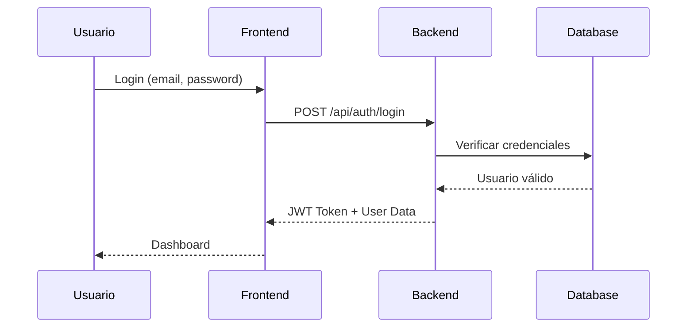
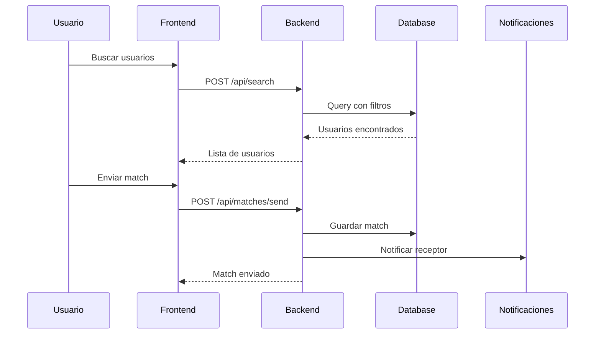

# Arquitectura del Sistema - Feeling

## 📋 Índice

- [Visión General](#visión-general)
- [Arquitectura de Alto Nivel](#arquitectura-de-alto-nivel)
- [Componentes del Sistema](#componentes-del-sistema)
- [Flujos de Datos](#flujos-de-datos)
- [Patrones de Diseño](#patrones-de-diseño)
- [Decisiones Arquitectónicas](#decisiones-arquitectónicas)
- [Seguridad](#seguridad)
- [Escalabilidad](#escalabilidad)
- [Diagrama de Componentes](#diagrama-de-componentes)

## 🎯 Visión General

Feeling utiliza una arquitectura de microservicios simplificada con separación clara entre frontend, backend y servicios de datos. La arquitectura está diseñada para ser:

- **Escalable**: Componentes independientes que pueden escalar horizontalmente
- **Mantenible**: Separación clara de responsabilidades
- **Segura**: Múltiples capas de seguridad
- **Resiliente**: Tolerancia a fallos y recuperación automática

## 🏗️ Arquitectura de Alto Nivel

```
┌─────────────────────────────────────────────────────────────────┐
│                          USUARIOS                                │
└────────────────────────────┬────────────────────────────────────┘
                             │
                    ┌────────▼────────┐
                    │   CloudFront    │
                    │      (CDN)      │
                    └────┬────────┬───┘
                         │        │
              ┌──────────▼───┐  ┌─▼──────────┐
              │  S3 Bucket   │  │    ALB     │
              │  (Frontend)  │  │            │
              └──────────────┘  └─────┬──────┘
                                      │
                               ┌──────▼──────┐
                               │  EC2 Cluster │
                               │  (Backend)   │
                               └──────┬──────┘
                                      │
                    ┌─────────────────┼─────────────────┐
                    │                 │                 │
              ┌─────▼─────┐    ┌─────▼─────┐    ┌─────▼─────┐
              │    RDS    │    │    S3     │    │   Redis   │
              │  (MySQL)  │    │ (Storage) │    │  (Cache)  │
              └───────────┘    └───────────┘    └───────────┘
```

## 🔧 Componentes del Sistema

### Frontend (React + Vite)

**Responsabilidades:**

- Interfaz de usuario responsive
- Gestión de estado local
- Validaciones client-side
- PWA capabilities

**Tecnologías:**

- React 18 con hooks
- Vite para bundling
- TailwindCSS para estilos
- Context API para estado

### Backend (Spring Boot)

**Responsabilidades:**

- Lógica de negocio
- Autenticación y autorización
- Validaciones server-side
- Integración con servicios externos

**Capas:**

1. **Controller Layer**: Endpoints REST
2. **Service Layer**: Lógica de negocio
3. **Repository Layer**: Acceso a datos
4. **Security Layer**: JWT y Spring Security

### Base de Datos (MySQL)

**Esquema principal:**

- Users & Profiles
- Matches & Interactions
- Events & Reservations
- Payments & Subscriptions

### Almacenamiento (S3/MinIO)

**Buckets:**

- `feeling-frontend`: Assets estáticos
- `feeling-images`: Fotos de usuarios
- `feeling-backups`: Respaldos automáticos

### Cache (Redis) - Futuro

**Uso previsto:**

- Sesiones de usuario
- Resultados de búsqueda
- Datos frecuentemente accedidos

## 🔄 Flujos de Datos

### Flujo de Autenticación



### Flujo de Matching



## 🎨 Patrones de Diseño

### Backend Patterns

1. **Repository Pattern**

   - Abstracción de acceso a datos
   - Facilita testing con mocks

2. **Service Layer Pattern**

   - Lógica de negocio centralizada
   - Transacciones declarativas

3. **DTO Pattern**

   - Separación entre entidades y API
   - Validación en boundaries

4. **Factory Pattern**
   - Creación de objetos complejos
   - Builders para entidades

### Frontend Patterns

1. **Container/Component Pattern**

   - Separación lógica/presentación
   - Componentes reutilizables

2. **Custom Hooks**

   - Lógica reutilizable
   - Composición sobre herencia

3. **Context Pattern**
   - Estado global sin prop drilling
   - Separación por dominio

## 📐 Decisiones Arquitectónicas

### ADR-001: Monolito Modular vs Microservicios

**Decisión**: Monolito modular
**Razón**:

- Simplicidad de despliegue
- Menor overhead operacional
- Facilita el desarrollo inicial
- Transacciones más simples

### ADR-002: React vs Vue/Angular

**Decisión**: React
**Razón**:

- Mayor ecosistema
- Mejor soporte para PWA
- Flexibilidad en arquitectura
- Comunidad más grande

### ADR-003: JWT vs Sessions

**Decisión**: JWT
**Razón**:

- Stateless
- Escalabilidad horizontal
- Ideal para SPA
- Soporte móvil futuro

### ADR-004: MySQL vs PostgreSQL

**Decisión**: MySQL
**Razón**:

- Mejor soporte en AWS RDS Free Tier
- Menor consumo de recursos
- Conocimiento del equipo
- Suficiente para los requisitos

## 🔒 Seguridad

### Capas de Seguridad

1. **Frontend**

   - Validación de inputs
   - Sanitización de datos
   - HTTPS obligatorio
   - CSP headers

2. **API Gateway**

   - Rate limiting
   - CORS configurado
   - API versioning
   - Request validation

3. **Backend**

   - JWT validation
   - Role-based access
   - Input validation
   - SQL injection prevention

4. **Database**
   - Encriptación at rest
   - Conexiones SSL
   - Principio menor privilegio
   - Auditoría de accesos

### Flujo de Seguridad

```
Usuario → HTTPS → CloudFront → ALB → Backend → RDS
                      ↓                  ↓
                   WAF Rules      Security Groups
```

## 📈 Escalabilidad

### Estrategias de Escalado

1. **Horizontal Scaling**

   - Auto Scaling Groups para EC2
   - Read replicas para RDS
   - CloudFront para contenido estático

2. **Vertical Scaling**

   - Upgrade de instancias según demanda
   - Reservas para costos optimizados

3. **Caching Strategy**
   - CloudFront para assets
   - Redis para datos frecuentes (futuro)
   - Browser caching optimizado

### Puntos de Escalabilidad

- **Frontend**: CDN infinitamente escalable
- **Backend**: Hasta 10 instancias EC2
- **Database**: Read replicas + connection pooling
- **Storage**: S3 escalabilidad ilimitada

## 📊 Diagrama de Componentes

### Diagrama de Despliegue

```
┌─────────────────────────────────────────────────────────┐
│                    AWS Cloud (us-east-1)                 │
├─────────────────────────────────────────────────────────┤
│  ┌─────────────────────VPC (10.0.0.0/16)─────────────┐  │
│  │                                                    │  │
│  │  ┌──────────Public Subnet──────────┐              │  │
│  │  │                                 │              │  │
│  │  │  ┌─────────┐    ┌─────────┐   │              │  │
│  │  │  │   EC2   │    │   EC2   │   │              │  │
│  │  │  │Backend 1│    │Backend 2│   │              │  │
│  │  │  └────┬────┘    └────┬────┘   │              │  │
│  │  │       │              │         │              │  │
│  │  │       └──────┬───────┘         │              │  │
│  │  │              │                 │              │  │
│  │  └──────────────┼─────────────────┘              │  │
│  │                 │                                 │  │
│  │  ┌──────────Private Subnet─────────┐             │  │
│  │  │              │                  │             │  │
│  │  │       ┌──────▼──────┐          │             │  │
│  │  │       │  RDS MySQL  │          │             │  │
│  │  │       │  Primary    │          │             │  │
│  │  │       └─────────────┘          │             │  │
│  │  │                                 │             │  │
│  │  └─────────────────────────────────┘             │  │
│  │                                                   │  │
│  └───────────────────────────────────────────────────┘  │
│                                                          │
│  ┌────────────┐  ┌────────────┐  ┌────────────┐       │
│  │ S3 Frontend│  │ S3 Images  │  │CloudFront  │       │
│  └────────────┘  └────────────┘  └────────────┘       │
└──────────────────────────────────────────────────────────┘
```

### Diagrama de Interacción

```
┌─────────┐     ┌─────────┐     ┌─────────┐     ┌─────────┐
│   User  │────▶│Frontend │────▶│ Backend │────▶│Database │
└─────────┘     └─────────┘     └─────────┘     └─────────┘
     │               │               │                 │
     │   Request     │   API Call    │   Query        │
     │──────────────▶│──────────────▶│───────────────▶│
     │               │               │                 │
     │   Response    │   JSON        │   Result       │
     │◀──────────────│◀──────────────│◀───────────────│
```

## 🔄 Ciclo de Vida de Desarrollo

### Ambientes

1. **Local**: Docker Compose
2. **Development**: AWS Dev Account
3. **Staging**: Pre-producción
4. **Production**: AWS Prod Account

### CI/CD Pipeline

```
Code Push → GitHub Actions → Build → Test → Deploy → Monitor
    │            │             │       │       │         │
    └────────────┴─────────────┴───────┴───────┴─────────┘
                         Automated Pipeline
```

## 📚 Documentación Técnica Adicional

- [API Documentation](./API.md)
- [Database Schema](./DATABASE.md)
- [Security Guidelines](./SECURITY.md)
- [Performance Optimization](./PERFORMANCE.md)

---

Para más información, consulta la [documentación principal](../README.md)
