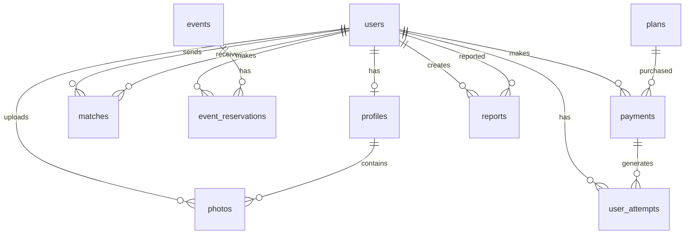

# Database Schema - Feeling

## 📋 Índice

- [Visión General](#visión-general)
- [Diagrama ER](#diagrama-er)
- [Tablas](#tablas)
  - [users](#users)
  - [profiles](#profiles)
  - [photos](#photos)
  - [matches](#matches)
  - [events](#events)
  - [event_reservations](#event_reservations)
  - [plans](#plans)
  - [payments](#payments)
  - [user_attempts](#user_attempts)
  - [reports](#reports)
- [Índices](#índices)
- [Triggers y Procedures](#triggers-y-procedures)
- [Migraciones](#migraciones)
- [Optimizaciones](#optimizaciones)

## 🎯 Visión General

La base de datos de Feeling utiliza MySQL 8.0 con las siguientes características:

- **Motor**: InnoDB para soporte transaccional
- **Charset**: utf8mb4 para soporte completo de Unicode
- **Collation**: utf8mb4_unicode_ci
- **Timezone**: UTC

## 📊 Diagrama ER



## 📋 Tablas

### users

Tabla principal de usuarios del sistema.

```sql
CREATE TABLE users (
    id BIGINT UNSIGNED AUTO_INCREMENT PRIMARY KEY,
    email VARCHAR(255) UNIQUE NOT NULL,
    password VARCHAR(255) NOT NULL,
    first_name VARCHAR(100) NOT NULL,
    last_name VARCHAR(100) NOT NULL,
    birth_date DATE NOT NULL,
    gender ENUM('MALE', 'FEMALE', 'OTHER') NOT NULL,
    city VARCHAR(100) NOT NULL,
    phone_number VARCHAR(20) UNIQUE,
    email_verified BOOLEAN DEFAULT FALSE,
    email_verification_token VARCHAR(255),
    email_verified_at TIMESTAMP NULL,
    password_reset_token VARCHAR(255),
    password_reset_expires TIMESTAMP NULL,
    role ENUM('USER', 'ADMIN') DEFAULT 'USER',
    active BOOLEAN DEFAULT TRUE,
    last_login TIMESTAMP NULL,
    created_at TIMESTAMP DEFAULT CURRENT_TIMESTAMP,
    updated_at TIMESTAMP DEFAULT CURRENT_TIMESTAMP ON UPDATE CURRENT_TIMESTAMP,

    INDEX idx_email (email),
    INDEX idx_city (city),
    INDEX idx_active (active),
    INDEX idx_created_at (created_at)
) ENGINE=InnoDB DEFAULT CHARSET=utf8mb4 COLLATE=utf8mb4_unicode_ci;
```

### profiles

Información detallada del perfil de usuario.

```sql
CREATE TABLE profiles (
    id BIGINT UNSIGNED AUTO_INCREMENT PRIMARY KEY,
    user_id BIGINT UNSIGNED UNIQUE NOT NULL,
    bio TEXT,
    occupation VARCHAR(100),
    education VARCHAR(100),
    height INT UNSIGNED,
    religion VARCHAR(50),
    sexual_orientation VARCHAR(50),
    relationship_goal ENUM('FRIENDSHIP', 'CASUAL', 'SERIOUS_RELATIONSHIP'),
    hobbies JSON,
    interests JSON,
    audio_url VARCHAR(500),
    profile_complete BOOLEAN DEFAULT FALSE,
    created_at TIMESTAMP DEFAULT CURRENT_TIMESTAMP,
    updated_at TIMESTAMP DEFAULT CURRENT_TIMESTAMP ON UPDATE CURRENT_TIMESTAMP,

    FOREIGN KEY (user_id) REFERENCES users(id) ON DELETE CASCADE,
    INDEX idx_user_id (user_id),
    INDEX idx_religion (religion),
    INDEX idx_relationship_goal (relationship_goal)
) ENGINE=InnoDB DEFAULT CHARSET=utf8mb4 COLLATE=utf8mb4_unicode_ci;
```

### photos

Fotos de perfil de usuarios.

```sql
CREATE TABLE photos (
    id BIGINT UNSIGNED AUTO_INCREMENT PRIMARY KEY,
    user_id BIGINT UNSIGNED NOT NULL,
    url VARCHAR(500) NOT NULL,
    thumbnail_url VARCHAR(500),
    is_main BOOLEAN DEFAULT FALSE,
    is_verified BOOLEAN DEFAULT FALSE,
    upload_date TIMESTAMP DEFAULT CURRENT_TIMESTAMP,

    FOREIGN KEY (user_id) REFERENCES users(id) ON DELETE CASCADE,
    INDEX idx_user_id (user_id),
    INDEX idx_is_main (is_main)
) ENGINE=InnoDB DEFAULT CHARSET=utf8mb4 COLLATE=utf8mb4_unicode_ci;
```

### matches

Sistema de matching entre usuarios.

```sql
CREATE TABLE matches (
    id BIGINT UNSIGNED AUTO_INCREMENT PRIMARY KEY,
    sender_id BIGINT UNSIGNED NOT NULL,
    receiver_id BIGINT UNSIGNED NOT NULL,
    status ENUM('PENDING', 'ACCEPTED', 'REJECTED') DEFAULT 'PENDING',
    message TEXT,
    matched_at TIMESTAMP NULL,
    responded_at TIMESTAMP NULL,
    created_at TIMESTAMP DEFAULT CURRENT_TIMESTAMP,

    FOREIGN KEY (sender_id) REFERENCES users(id) ON DELETE CASCADE,
    FOREIGN KEY (receiver_id) REFERENCES users(id) ON DELETE CASCADE,
    UNIQUE KEY unique_match (sender_id, receiver_id),
    INDEX idx_sender_id (sender_id),
    INDEX idx_receiver_id (receiver_id),
    INDEX idx_status (status),
    INDEX idx_created_at (created_at)
) ENGINE=InnoDB DEFAULT CHARSET=utf8mb4 COLLATE=utf8mb4_unicode_ci;
```

### events

Eventos organizados por la plataforma.

```sql
CREATE TABLE events (
    id BIGINT UNSIGNED AUTO_INCREMENT PRIMARY KEY,
    title VARCHAR(255) NOT NULL,
    description TEXT,
    event_date DATETIME NOT NULL,
    location_name VARCHAR(255) NOT NULL,
    location_address VARCHAR(500),
    city VARCHAR(100) NOT NULL,
    latitude DECIMAL(10, 8),
    longitude DECIMAL(11, 8),
    capacity INT UNSIGNED NOT NULL,
    price DECIMAL(10, 2) NOT NULL,
    image_url VARCHAR(500),
    tags JSON,
    status ENUM('DRAFT', 'PUBLISHED', 'CANCELLED', 'COMPLETED') DEFAULT 'DRAFT',
    created_by BIGINT UNSIGNED,
    created_at TIMESTAMP DEFAULT CURRENT_TIMESTAMP,
    updated_at TIMESTAMP DEFAULT CURRENT_TIMESTAMP ON UPDATE CURRENT_TIMESTAMP,

    FOREIGN KEY (created_by) REFERENCES users(id) ON DELETE SET NULL,
    INDEX idx_event_date (event_date),
    INDEX idx_city (city),
    INDEX idx_status (status)
) ENGINE=InnoDB DEFAULT CHARSET=utf8mb4 COLLATE=utf8mb4_unicode_ci;
```

### event_reservations

Reservas de usuarios para eventos.

```sql
CREATE TABLE event_reservations (
    id BIGINT UNSIGNED AUTO_INCREMENT PRIMARY KEY,
    event_id BIGINT UNSIGNED NOT NULL,
    user_id BIGINT UNSIGNED NOT NULL,
    attendees INT UNSIGNED DEFAULT 1,
    special_requirements TEXT,
    status ENUM('CONFIRMED', 'CANCELLED', 'ATTENDED', 'NO_SHOW') DEFAULT 'CONFIRMED',
    payment_id BIGINT UNSIGNED,
    created_at TIMESTAMP DEFAULT CURRENT_TIMESTAMP,
    cancelled_at TIMESTAMP NULL,

    FOREIGN KEY (event_id) REFERENCES events(id) ON DELETE CASCADE,
    FOREIGN KEY (user_id) REFERENCES users(id) ON DELETE CASCADE,
    FOREIGN KEY (payment_id) REFERENCES payments(id) ON DELETE SET NULL,
    UNIQUE KEY unique_reservation (event_id, user_id),
    INDEX idx_event_id (event_id),
    INDEX idx_user_id (user_id),
    INDEX idx_status (status)
) ENGINE=InnoDB DEFAULT CHARSET=utf8mb4 COLLATE=utf8mb4_unicode_ci;
```

### plans

Planes de suscripción disponibles.

```sql
CREATE TABLE plans (
    id BIGINT UNSIGNED AUTO_INCREMENT PRIMARY KEY,
    code VARCHAR(50) UNIQUE NOT NULL,
    name VARCHAR(100) NOT NULL,
    description TEXT,
    price DECIMAL(10, 2) NOT NULL,
    attempts INT UNSIGNED NOT NULL,
    validity_days INT UNSIGNED NOT NULL DEFAULT 365,
    features JSON,
    is_popular BOOLEAN DEFAULT FALSE,
    is_active BOOLEAN DEFAULT TRUE,
    created_at TIMESTAMP DEFAULT CURRENT_TIMESTAMP,

    INDEX idx_code (code),
    INDEX idx_is_active (is_active)
) ENGINE=InnoDB DEFAULT CHARSET=utf8mb4 COLLATE=utf8mb4_unicode_ci;

-- Datos iniciales
INSERT INTO plans (code, name, description, price, attempts, features, is_popular) VALUES
('basic', 'Plan Básico', '1 intento de conexión', 200000, 1, '["1 intento de match", "Vigencia de 1 año", "Soporte por email"]', FALSE),
('extended', 'Plan Extendido', '3 intentos de conexión', 400000, 3, '["3 intentos de match", "Vigencia de 1 año", "Soporte prioritario", "Acceso a eventos exclusivos"]', TRUE);
```

### payments

Registro de pagos realizados.

```sql
CREATE TABLE payments (
    id BIGINT UNSIGNED AUTO_INCREMENT PRIMARY KEY,
    user_id BIGINT UNSIGNED NOT NULL,
    plan_id BIGINT UNSIGNED NOT NULL,
    amount DECIMAL(10, 2) NOT NULL,
    payment_method ENUM('CREDIT_CARD', 'DEBIT_CARD', 'PSE', 'CASH') NOT NULL,
    transaction_id VARCHAR(255) UNIQUE,
    status ENUM('PENDING', 'COMPLETED', 'FAILED', 'REFUNDED') DEFAULT 'PENDING',
    payment_data JSON,
    completed_at TIMESTAMP NULL,
    expires_at TIMESTAMP NOT NULL,
    created_at TIMESTAMP DEFAULT CURRENT_TIMESTAMP,

    FOREIGN KEY (user_id) REFERENCES users(id) ON DELETE CASCADE,
    FOREIGN KEY (plan_id) REFERENCES plans(id),
    INDEX idx_user_id (user_id),
    INDEX idx_status (status),
    INDEX idx_transaction_id (transaction_id),
    INDEX idx_created_at (created_at)
) ENGINE=InnoDB DEFAULT CHARSET=utf8mb4 COLLATE=utf8mb4_unicode_ci;
```

### user_attempts

Control de intentos de match por usuario.

```sql
CREATE TABLE user_attempts (
    id BIGINT UNSIGNED AUTO_INCREMENT PRIMARY KEY,
    user_id BIGINT UNSIGNED NOT NULL,
    payment_id BIGINT UNSIGNED NOT NULL,
    total_attempts INT UNSIGNED NOT NULL,
    used_attempts INT UNSIGNED DEFAULT 0,
    expires_at TIMESTAMP NOT NULL,
    created_at TIMESTAMP DEFAULT CURRENT_TIMESTAMP,

    FOREIGN KEY (user_id) REFERENCES users(id) ON DELETE CASCADE,
    FOREIGN KEY (payment_id) REFERENCES payments(id) ON DELETE CASCADE,
    INDEX idx_user_id (user_id),
    INDEX idx_expires_at (expires_at)
) ENGINE=InnoDB DEFAULT CHARSET=utf8mb4 COLLATE=utf8mb4_unicode_ci;
```

### reports

Sistema de reportes y moderación.

```sql
CREATE TABLE reports (
    id BIGINT UNSIGNED AUTO_INCREMENT PRIMARY KEY,
    reporter_id BIGINT UNSIGNED NOT NULL,
    reported_user_id BIGINT UNSIGNED NOT NULL,
    reason ENUM('INAPPROPRIATE_CONTENT', 'FAKE_PROFILE', 'HARASSMENT', 'SPAM', 'OTHER') NOT NULL,
    description TEXT,
    evidence JSON,
    status ENUM('PENDING', 'REVIEWING', 'RESOLVED', 'DISMISSED') DEFAULT 'PENDING',
    action_taken ENUM('NONE', 'WARNING', 'SUSPENSION', 'BAN') DEFAULT 'NONE',
    admin_notes TEXT,
    resolved_by BIGINT UNSIGNED,
    resolved_at TIMESTAMP NULL,
    created_at TIMESTAMP DEFAULT CURRENT_TIMESTAMP,

    FOREIGN KEY (reporter_id) REFERENCES users(id) ON DELETE CASCADE,
    FOREIGN KEY (reported_user_id) REFERENCES users(id) ON DELETE CASCADE,
    FOREIGN KEY (resolved_by) REFERENCES users(id) ON DELETE SET NULL,
    INDEX idx_reported_user (reported_user_id),
    INDEX idx_status (status),
    INDEX idx_created_at (created_at)
) ENGINE=InnoDB DEFAULT CHARSET=utf8mb4 COLLATE=utf8mb4_unicode_ci;
```

## 🔍 Índices

### Índices de rendimiento crítico

```sql
-- Búsqueda de usuarios por ciudad y edad
CREATE INDEX idx_users_city_birthdate ON users(city, birth_date);

-- Matches activos entre usuarios
CREATE INDEX idx_matches_users_status ON matches(sender_id, receiver_id, status);

-- Búsqueda de eventos próximos
CREATE INDEX idx_events_date_city_status ON events(event_date, city, status);

-- Intentos activos de usuario
CREATE INDEX idx_user_attempts_active ON user_attempts(user_id, expires_at)
WHERE used_attempts < total_attempts;
```

## 🔧 Triggers y Procedures

### Trigger: Actualizar profile_complete

```sql
DELIMITER $
CREATE TRIGGER update_profile_complete
AFTER UPDATE ON profiles
FOR EACH ROW
BEGIN
    DECLARE is_complete BOOLEAN DEFAULT FALSE;

    IF NEW.bio IS NOT NULL
       AND NEW.occupation IS NOT NULL
       AND NEW.hobbies IS NOT NULL
       AND JSON_LENGTH(NEW.hobbies) > 0 THEN
        SET is_complete = TRUE;
    END IF;

    IF NEW.profile_complete != is_complete THEN
        UPDATE profiles
        SET profile_complete = is_complete
        WHERE id = NEW.id;
    END IF;
END$
DELIMITER ;
```

### Procedure: Calcular estadísticas de usuario

```sql
DELIMITER $
CREATE PROCEDURE get_user_stats(IN p_user_id BIGINT)
BEGIN
    SELECT
        (SELECT COUNT(*) FROM matches WHERE sender_id = p_user_id) as matches_sent,
        (SELECT COUNT(*) FROM matches WHERE receiver_id = p_user_id) as matches_received,
        (SELECT COUNT(*) FROM matches
         WHERE (sender_id = p_user_id OR receiver_id = p_user_id)
         AND status = 'ACCEPTED') as successful_matches,
        (SELECT COUNT(*) FROM event_reservations
         WHERE user_id = p_user_id AND status = 'ATTENDED') as events_attended,
        (SELECT COALESCE(SUM(total_attempts - used_attempts), 0)
         FROM user_attempts
         WHERE user_id = p_user_id AND expires_at > NOW()) as available_attempts;
END$
DELIMITER ;
```

### Procedure: Buscar usuarios compatibles

```sql
DELIMITER $
CREATE PROCEDURE search_compatible_users(
    IN p_user_id BIGINT,
    IN p_gender VARCHAR(10),
    IN p_min_age INT,
    IN p_max_age INT,
    IN p_city VARCHAR(100),
    IN p_limit INT,
    IN p_offset INT
)
BEGIN
    SELECT
        u.id,
        u.first_name,
        u.last_name,
        YEAR(CURDATE()) - YEAR(u.birth_date) as age,
        u.city,
        p.bio,
        p.occupation,
        p.hobbies,
        p.interests,
        ph.url as main_photo,
        -- Calcular porcentaje de compatibilidad básico
        CASE
            WHEN p.hobbies IS NOT NULL AND p2.hobbies IS NOT NULL THEN
                (JSON_LENGTH(JSON_ARRAY_INTERSECT(p.hobbies, p2.hobbies)) * 100.0 /
                 GREATEST(JSON_LENGTH(p.hobbies), JSON_LENGTH(p2.hobbies)))
            ELSE 0
        END as compatibility_score
    FROM users u
    INNER JOIN profiles p ON u.id = p.user_id
    LEFT JOIN photos ph ON u.id = ph.user_id AND ph.is_main = TRUE
    LEFT JOIN profiles p2 ON p2.user_id = p_user_id
    WHERE u.id != p_user_id
        AND u.active = TRUE
        AND u.gender = p_gender
        AND u.birth_date BETWEEN DATE_SUB(CURDATE(), INTERVAL p_max_age YEAR)
                            AND DATE_SUB(CURDATE(), INTERVAL p_min_age YEAR)
        AND u.city = p_city
        AND NOT EXISTS (
            SELECT 1 FROM matches m
            WHERE (m.sender_id = p_user_id AND m.receiver_id = u.id)
               OR (m.sender_id = u.id AND m.receiver_id = p_user_id)
        )
    ORDER BY compatibility_score DESC, u.last_login DESC
    LIMIT p_limit OFFSET p_offset;
END$
DELIMITER ;
```

## 📈 Migraciones

### Sistema de migraciones

```sql
CREATE TABLE migrations (
    id INT AUTO_INCREMENT PRIMARY KEY,
    version VARCHAR(50) NOT NULL UNIQUE,
    description VARCHAR(255),
    executed_at TIMESTAMP DEFAULT CURRENT_TIMESTAMP,
    INDEX idx_version (version)
);
```

### Ejemplo de migración

```sql
-- Migration: V1__initial_schema.sql
START TRANSACTION;

-- Crear tablas...

INSERT INTO migrations (version, description)
VALUES ('V1', 'Initial schema creation');

COMMIT;
```

## 🚀 Optimizaciones

### Configuración MySQL

```ini
# my.cnf optimizations for Feeling
[mysqld]
# Buffer pool para InnoDB (70% de RAM disponible)
innodb_buffer_pool_size = 1G
innodb_buffer_pool_instances = 4

# Logs y performance
innodb_log_file_size = 256M
innodb_flush_log_at_trx_commit = 2
innodb_flush_method = O_DIRECT

# Conexiones
max_connections = 200
max_connect_errors = 10000

# Cache de queries
query_cache_type = 1
query_cache_size = 64M
query_cache_limit = 2M

# Temp tables
tmp_table_size = 64M
max_heap_table_size = 64M

# Slow query log
slow_query_log = 1
slow_query_log_file = /var/log/mysql/slow-query.log
long_query_time = 2
```

### Particionamiento

```sql
-- Particionar tabla de matches por año
ALTER TABLE matches
PARTITION BY RANGE (YEAR(created_at)) (
    PARTITION p2023 VALUES LESS THAN (2024),
    PARTITION p2024 VALUES LESS THAN (2025),
    PARTITION p2025 VALUES LESS THAN (2026),
    PARTITION p_future VALUES LESS THAN MAXVALUE
);
```

### Mantenimiento

```sql
-- Script de mantenimiento semanal
-- Analizar tablas
ANALYZE TABLE users, profiles, matches, events;

-- Optimizar tablas fragmentadas
OPTIMIZE TABLE photos, event_reservations;

-- Limpiar datos antiguos
DELETE FROM email_verification_tokens
WHERE created_at < DATE_SUB(NOW(), INTERVAL 7 DAY);

DELETE FROM password_reset_tokens
WHERE expires_at < NOW();
```

## 📊 Monitoreo

### Queries útiles para monitoreo

```sql
-- Usuarios activos por día
SELECT DATE(last_login) as day, COUNT(*) as active_users
FROM users
WHERE last_login > DATE_SUB(NOW(), INTERVAL 30 DAY)
GROUP BY DATE(last_login);

-- Tasa de éxito de matches
SELECT
    COUNT(*) as total_matches,
    SUM(CASE WHEN status = 'ACCEPTED' THEN 1 ELSE 0 END) as accepted,
    (SUM(CASE WHEN status = 'ACCEPTED' THEN 1 ELSE 0 END) * 100.0 / COUNT(*)) as success_rate
FROM matches
WHERE created_at > DATE_SUB(NOW(), INTERVAL 30 DAY);

-- Ingresos por mes
SELECT
    DATE_FORMAT(completed_at, '%Y-%m') as month,
    COUNT(*) as transactions,
    SUM(amount) as total_revenue
FROM payments
WHERE status = 'COMPLETED'
GROUP BY DATE_FORMAT(completed_at, '%Y-%m')
ORDER BY month DESC;
```

---

Para más información, consulta la [documentación principal](../README.md)
